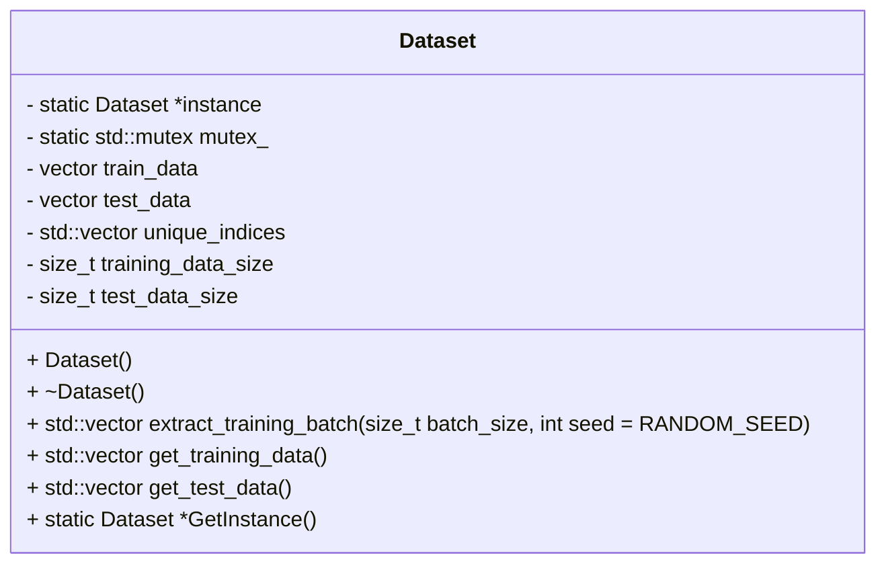

# Dataset Class Documentation

The `Dataset` class is a C++ class that represents a dataset of digit images for training and testing purposes in MNIST digit recognition. This documentation provides a detailed overview of the class structure, functionality, implementation details, and conclusion.

## Class Structure

The `Dataset` class has the following structure:

```cpp
class Dataset {
private:
    static Dataset *instance;
    static std::mutex mutex_;

protected:
    vector<DigitImage> train_data;
    vector<DigitImage> test_data;
    std::vector<size_t> unique_indices;

    Dataset();
    ~Dataset();

public:
    size_t training_data_size;
    size_t test_data_size;

    Dataset(Dataset& other) = delete;
    void operator=(const Dataset&) = delete;

    std::vector<DigitImage> extract_training_batch(size_t batch_size, int seed = RANDOM_SEED);
    std::vector<DigitImage> get_training_data();
    std::vector<DigitImage> get_test_data();

    static Dataset* GetInstance();
};
```


## Functionality

The `Dataset` class provides the following functionality:

- Private members:
    - `instance`: A pointer to the singleton instance of the `Dataset` class.
    - `mutex_`: A mutex for thread-safe initialization of the singleton instance.
    - `train_data`: A vector of `DigitImage` objects representing the training data.
    - `test_data`: A vector of `DigitImage` objects representing the test data.
    - `unique_indices`: A vector of indices used for random selection of training data.

- Public members:
    - `training_data_size`: The size of the training data.
    - `test_data_size`: The size of the test data.

- Constructors and Destructors:
    - `Dataset()`: Private constructor that loads the MNIST dataset and initializes the training and test data.
    - `~Dataset()`: Default destructor.

- Deleted Members:
    - `Dataset(Dataset& other)`: Copy constructor is deleted to prevent copying of the singleton instance.
    - `operator=(const Dataset&)`: Copy assignment operator is deleted to prevent copying of the singleton instance.

- Member Functions:
    - `std::vector<DigitImage> extract_training_batch(size_t batch_size, int seed = RANDOM_SEED)`: Extracts a batch of `DigitImage` objects from the training data. The batch size and an optional seed for random shuffling can be specified.
    - `std::vector<DigitImage> get_training_data()`: Retrieves the training data as a vector of `DigitImage` objects.
    - `std::vector<DigitImage> get_test_data()`: Retrieves the test data as a vector of `DigitImage` objects.
    - `static Dataset* GetInstance()`: Retrieves the singleton instance of the `Dataset` class.

## Implementation Details

- The `Dataset` class follows the singleton design pattern to ensure that only one instance of the class exists.
- The class uses a private constructor to load the MNIST dataset and initialize the training and test data.
- The `train_data` and `test_data` vectors store `DigitImage` objects representing the digit images in the dataset.
- The `unique_indices` vector is used to keep track of indices for random selection of training data.
- The class provides member functions to extract training batches, retrieve the training and test data, and retrieve the singleton instance.
- The singleton instance is lazily initialized and accessed using the `GetInstance()` static member function, which ensures thread safety using a mutex.

## Conclusion

The `Dataset` class provides a convenient interface for accessing the MNIST dataset for digit recognition tasks. It manages the training and test data, provides methods for extracting training batches,

and follows the singleton design pattern to ensure a single instance of the dataset is used throughout the program.