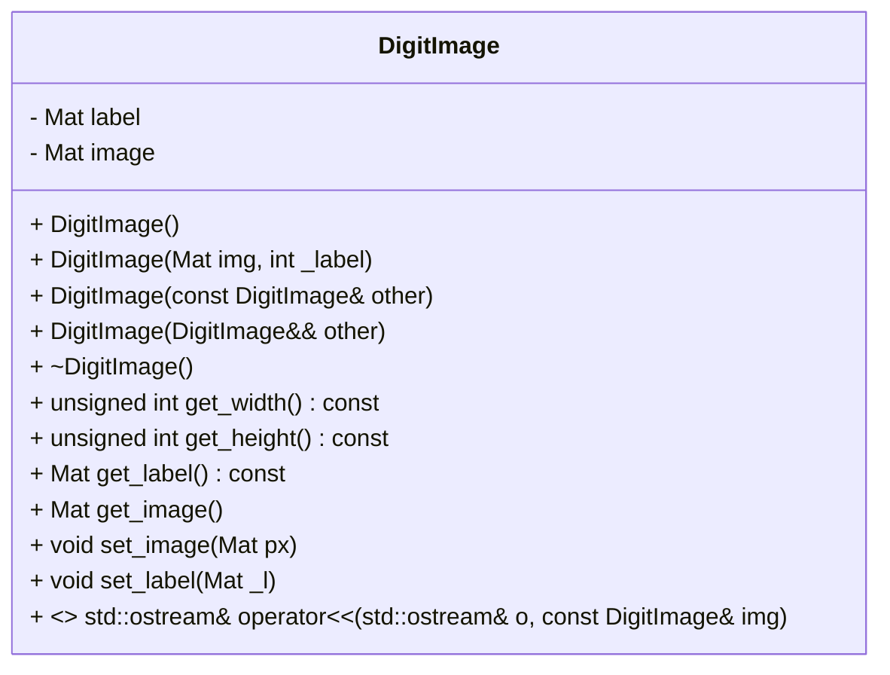

# DigitImage Class Documentation

The `DigitImage` class is a C++ class that represents a digit image, specifically designed for digit recognition tasks using the MNIST dataset. This documentation provides a detailed overview of the class structure, functionality, implementation details, and conclusion.

## Class Structure

The `DigitImage` class has the following structure:

```cpp
class DigitImage {
    using Mat = Matrix<double>;

private:
    Mat label;
    Mat image;

public:
    // Constructors
    DigitImage() = default;
    DigitImage(Mat img, int _label);
    DigitImage(const DigitImage& other);
    DigitImage(DigitImage&& other) noexcept;

    // Destructors
    virtual ~DigitImage() = default;

    // Getters
    unsigned int get_width() const;
    unsigned int get_height() const;
    Mat get_label() const;
    Mat get_image();

    // Setters
    void set_image(Mat px);
    void set_label(Mat _l);

    // Operator Overloads
    friend std::ostream& operator<<(std::ostream& o, const DigitImage& img);
};
```



## Functionality

The `DigitImage` class provides the following functionality:

- Constructors:
    - `DigitImage()`: Default constructor.
    - `DigitImage(Mat img, int _label)`: Constructs a `DigitImage` object with the given pixel matrix `img` and corresponding label `_label`.
    - `DigitImage(const DigitImage& other)`: Copy constructor.
    - `DigitImage(DigitImage&& other) noexcept`: Move constructor.

- Destructors:
    - `virtual ~DigitImage()`: Default destructor.

- Getters:
    - `unsigned int get_width() const`: Retrieves the width of the image (number of columns).
    - `unsigned int get_height() const`: Retrieves the height of the image (number of rows).
    - `Mat get_label() const`: Retrieves the label matrix of the image.
    - `Mat get_image()`: Retrieves the image matrix.

- Setters:
    - `void set_image(Mat px)`: Sets the pixel matrix of the image to the given matrix `px`.
    - `void set_label(Mat _l)`: Sets the label matrix of the image to the given matrix `_l`.

- Operator Overloads:
    - `friend std::ostream& operator<<(std::ostream& o, const DigitImage& img)`: Overload of the output stream operator (`<<`) to allow printing the digit image to an output stream.

## Implementation Details

- The `DigitImage` class uses the `Matrix` class internally, defined in the "matrix.h" header file.
- The `image` member variable represents the pixel matrix of the digit image.
- The `label` member variable represents the label matrix of the digit image.
- The class provides constructors for creating `DigitImage` objects with pixel matrices and corresponding labels.
- The class supports copying and moving of `DigitImage` objects.
- Getter methods are provided to retrieve the width, height, label, and pixel matrix of the digit image.
- Setter methods allow setting the pixel matrix and label of the digit image.
- The `operator<<` overload allows printing the digit image's label and pixel matrix.

## Conclusion

The `DigitImage` class provides a convenient representation for digit images in MNIST digit recognition tasks. It encapsulates the pixel matrix and label matrix of a digit image and provides essential functionality for retrieving and setting image properties.