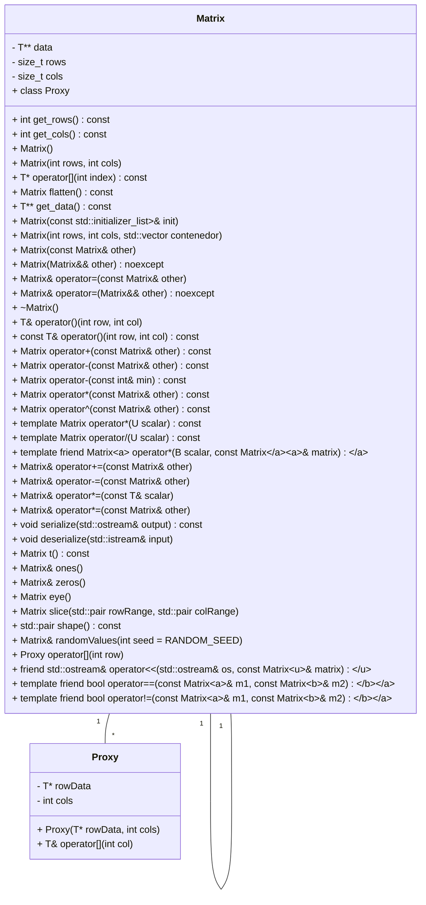

# Matrix Class Documentation

The `Matrix` class is a C++ template class that represents a matrix of elements. This class provides various functionalities for matrix operations and manipulations. This documentation provides a detailed overview of the class structure, functionality, implementation details, and conclusion.

## Class Structure

The `Matrix` class has the following structure:

```cpp
template <typename T>
class Matrix {
private:
    T** data = nullptr;
    size_t rows {};
    size_t cols {};

public:
    // Constructors and Destructors
    Matrix();
    Matrix(int rows, int cols);
    Matrix(const std::initializer_list<std::initializer_list<T>>& init);
    Matrix(int rows, int cols, std::vector<float> contenedor);
    Matrix(const Matrix& other);
    Matrix(Matrix&& other) noexcept;
    ~Matrix();

    // Getter functions
    int get_rows() const;
    int get_cols() const;
    T** get_data() const;

    // Operator overloads
    T* operator[](int index) const;
    T& operator()(int row, int col);
    const T& operator()(int row, int col) const;
    Matrix operator+(const Matrix& other) const;
    Matrix operator-(const Matrix& other) const;
    Matrix operator-(const int& min) const;
    Matrix operator*(const Matrix& other) const;
    Matrix operator^(const Matrix& other) const;
    template<typename U>
    Matrix operator*(U scalar) const;
    template<typename U>
    Matrix operator/(U scalar) const;
    template<typename A, typename B>
    friend Matrix<A> operator*(B scalar, const Matrix<A>& matrix);
    Matrix& operator+=(const Matrix& other);
    Matrix& operator-=(const Matrix& other);
    Matrix& operator*=(const T& scalar);
    Matrix& operator*=(const Matrix& other);

    // Other member functions
    Matrix flatten() const;
    Matrix t() const;
    Matrix& ones();
    Matrix& zeros();
    Matrix eye();
    Matrix slice(std::pair<T,T> rowRange, std::pair<T,T> colRange);
    std::pair<int,int> shape() const;
    Matrix& randomValues(int seed = RANDOM_SEED);
    void serialize(std::ostream &output) const;
    void deserialize(std::istream &input);
};
```



## Functionality

The `Matrix` class provides the following functionality:

- Constructors and Destructors:
    - `Matrix()`: Default constructor.
    - `Matrix(int rows, int cols)`: Constructs a matrix with the specified number of `rows` and `cols`.
    - `Matrix(const std::initializer_list<std::initializer_list<T>>& init)`: Constructs a matrix from an initializer list.
    - `Matrix(int rows, int cols, std::vector<float> contenedor)`: Constructs a matrix with the specified dimensions and values from a vector.
    - `Matrix(const Matrix& other)`: Copy constructor.
    - `Matrix(Matrix&& other) noexcept`: Move constructor.
    - `~Matrix()`: Destructor.

- Getter functions:
    - `int get_rows() const`: Retrieves the number of rows in the matrix.
    - `int get_cols() const`: Retrieves the number of columns in the matrix.
    - `T** get_data() const`: Retrieves a pointer to the matrix data.

- Operator overloads:
    - `T* operator[](int index) const`: Overload of the indexing operator (`[]`) to access a specific row of the matrix.
    - `T& operator()(int row, int col)`: Overload of the function call operator (`()`) to access a specific element of the matrix.
    - `const T&

operator()(int row, int col) const`: Overload of the function call operator (`()`) to access a specific element of the matrix (const version).
- `Matrix operator+(const Matrix& other) const`: Overload of the addition operator (`+`) to perform element-wise addition of two matrices.
- `Matrix operator-(const Matrix& other) const`: Overload of the subtraction operator (`-`) to perform element-wise subtraction of two matrices.
- `Matrix operator-(const int& min) const`: Overload of the subtraction operator (`-`) to subtract a constant value from all elements of the matrix.
- `Matrix operator*(const Matrix& other) const`: Overload of the multiplication operator (`*`) to perform matrix multiplication.
- `Matrix operator^(const Matrix& other) const`: Overload of the power operator (`^`) to perform element-wise multiplication of two matrices.
- `template<typename U> Matrix operator*(U scalar) const`: Overload of the multiplication operator (`*`) to perform scalar multiplication of the matrix.
- `template<typename U> Matrix operator/(U scalar) const`: Overload of the division operator (`/`) to perform scalar division of the matrix.
- `template<typename A, typename B> friend Matrix<A> operator*(B scalar, const Matrix<A>& matrix)`: Overload of the multiplication operator (`*`) to perform scalar multiplication of the matrix (scalar on the left).
- `Matrix& operator+=(const Matrix& other)`: Overload of the compound addition assignment operator (`+=`) to perform element-wise addition and assignment.
- `Matrix& operator-=(const Matrix& other)`: Overload of the compound subtraction assignment operator (`-=`) to perform element-wise subtraction and assignment.
- `Matrix& operator*=(const T& scalar)`: Overload of the compound multiplication assignment operator (`*=`) to perform scalar multiplication and assignment.
- `Matrix& operator*=(const Matrix& other)`: Overload of the compound multiplication assignment operator (`*=`) to perform matrix multiplication and assignment.

- Other member functions:
    - `Matrix flatten() const`: Flattens the matrix into a column matrix (1 column).
    - `Matrix t() const`: Returns the transpose of the matrix.
    - `Matrix& ones()`: Sets all elements of the matrix to 1.
    - `Matrix& zeros()`: Sets all elements of the matrix to 0.
    - `Matrix eye()`: Creates an identity matrix.
    - `Matrix slice(std::pair<T,T> rowRange, std::pair<T,T> colRange)`: Extracts a submatrix from the matrix based on specified row and column ranges.
    - `std::pair<int,int> shape() const`: Retrieves the shape of the matrix as a pair of integers (rows, cols).
    - `Matrix& randomValues(int seed = RANDOM_SEED)`: Fills the matrix with random values using the specified seed.
    - `void serialize(std::ostream &output) const`: Serializes the matrix data into an output stream.
    - `void deserialize(std::istream &input)`: Deserializes the matrix data from an input stream.

## Implementation Details

- The `Matrix` class uses a dynamic 2D array (`data`) to store the matrix elements.
- The `rows` and `cols` member variables store the dimensions of the matrix.
- The class provides constructors for creating matrices with specified dimensions, initializing from an initializer list, and initializing from a vector.
- Getter functions allow retrieving the number of rows and columns, as well as a pointer to the matrix data.
- Operator overloads enable various matrix operations such as element-wise addition, subtraction, multiplication,

and scalar operations.
- Other member functions support operations like flattening, transposing, setting elements to ones or zeros, creating identity matrices, slicing, retrieving the shape, generating random values, and serializing/deserializing matrix data.
- The class follows RAII (Resource Acquisition Is Initialization) principles by properly managing memory allocation and deallocation in constructors, destructors, and move/copy operations.

## Conclusion

The `Matrix` class provides a flexible and efficient implementation of matrices in C++. It supports a wide range of matrix operations and provides convenient member functions for manipulating and accessing matrix elements. Whether it's performing basic matrix arithmetic or more advanced operations like transposition and serialization, the `Matrix` class offers a comprehensive set of functionalities for working with matrices.