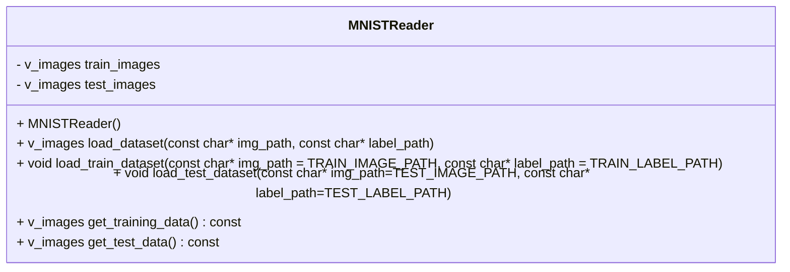

# MNISTReader Class Documentation

The `MNISTReader` class is responsible for loading and parsing the MNIST dataset, which consists of handwritten digit images and their corresponding labels. This class provides functions to load the dataset from binary files, preprocess the data, and retrieve the training and test images.

## Class Structure

The `MNISTReader` class has the following structure:

```cpp
class MNISTReader {
    using v_images = std::vector<DigitImage>;

private:
    v_images train_images;
    v_images test_images;

public:
    // Constructors
    MNISTReader() = default;

    // Dataset Loading
    v_images load_dataset(const char* img_path, const char* label_path);
    void load_train_dataset(const char* img_path = TRAIN_IMAGE_PATH, const char* label_path = TRAIN_LABEL_PATH);
    void load_test_dataset(const char* img_path = TEST_IMAGE_PATH, const char* label_path = TEST_LABEL_PATH);

    // Getters
    v_images get_training_data() const;
    v_images get_test_data() const;
};
```



## Functionality

The `MNISTReader` class provides the following functionality:

- Constructors:
    - `MNISTReader()`: Default constructor.

- Dataset Loading:
    - `v_images load_dataset(const char* img_path, const char* label_path)`: Loads the MNIST dataset from binary image and label files specified by `img_path` and `label_path`. It returns a vector of `DigitImage` objects representing the loaded images.
    - `void load_train_dataset(const char* img_path = TRAIN_IMAGE_PATH, const char* label_path = TRAIN_LABEL_PATH)`: Loads the training dataset from the default image and label files, or the provided file paths.
    - `void load_test_dataset(const char* img_path = TEST_IMAGE_PATH, const char* label_path = TEST_LABEL_PATH)`: Loads the test dataset from the default image and label files, or the provided file paths.

- Getters:
    - `v_images get_training_data() const`: Retrieves the vector of `DigitImage` objects representing the loaded training images.
    - `v_images get_test_data() const`: Retrieves the vector of `DigitImage` objects representing the loaded test images.

## Implementation Details

- The `MNISTReader` class uses vectors of `DigitImage` objects (`train_images` and `test_images`) to store the loaded image data.
- The `load_dataset` function reads the binary image and label files, extracts the necessary information, and creates `DigitImage` objects for each image-label pair.
- The image and label files are read in binary mode using `std::ifstream`.
- The pixel values of the images are normalized to the range [0, 1] by dividing each pixel value by 255.0f.
- The `load_train_dataset` and `load_test_dataset` functions provide convenient wrappers for loading the training and test datasets with default or custom file paths.
- The getter functions allow accessing the loaded training and test images.

## Conclusion

The `MNISTReader` class simplifies the process of loading and parsing the MNIST dataset in C++. It provides functions to load the dataset from binary files, preprocess the data, and retrieve the training and test images. By using this class, developers can easily integrate MNIST dataset loading into their machine learning or computer vision projects.