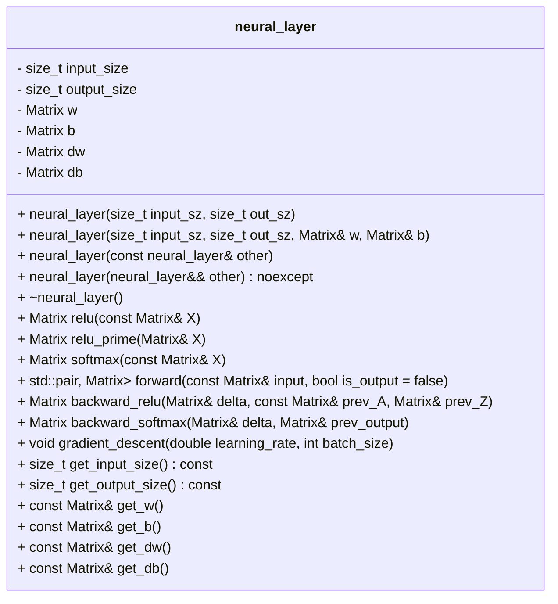

# Neural Layer Class Documentation

The `neural_layer` class represents a single layer in a neural network. It consists of a weight matrix (`w`), a bias matrix (`b`), and provides functionalities for forward propagation, backward propagation, and gradient descent.

## Class Structure

The `neural_layer` class has the following structure:

```cpp
template<typename T>
class neural_layer {
private:
    size_t input_size = 0;
    size_t output_size = 0;

    Matrix<T> w;
    Matrix<T> b;

    Matrix<T> dw;
    Matrix<T> db;

public:
    // Constructors
    neural_layer(size_t input_sz, size_t out_sz);
    neural_layer(size_t input_sz, size_t out_sz, Matrix<T>& w, Matrix<T>& b);
    neural_layer(const neural_layer& other);
    neural_layer(neural_layer&& other) noexcept;

    // Destructor
    ~neural_layer() =default;

    // Forward propagation functions
    Matrix<T> relu(const Matrix<T>& X);
    Matrix<T> relu_prime(Matrix<T>& X);
    Matrix<T> softmax(const Matrix<T>& X);
    std::pair<Matrix<T>,Matrix<T>> forward(const Matrix<T>& input, bool is_output = false);

    // Backward propagation functions
    Matrix<double> backward_relu(Matrix<T>& delta, const Matrix<T>& prev_A, Matrix<T>& prev_Z);
    Matrix<double> backward_softmax(Matrix<double>& delta, Matrix<double>& prev_output);

    // Gradient descent
    void gradient_descent(double learning_rate, int batch_size);

    // Getters
    size_t get_input_size() const;
    size_t get_output_size() const;
    const Matrix<T>& get_w();
    const Matrix<T>& get_b();
    const Matrix<T>& get_dw();
    const Matrix<T>& get_db();
};
```



## Functionality

The `neural_layer` class provides the following functionality:

- Constructors:
    - `neural_layer(size_t input_sz, size_t out_sz)`: Creates a neural layer with the given input and output sizes. Initializes the weight matrix `w` and bias matrix `b` with random values.
    - `neural_layer(size_t input_sz, size_t out_sz, Matrix<T>& w, Matrix<T>& b)`: Creates a neural layer with the given input and output sizes, using the provided weight matrix `w` and bias matrix `b`.
    - `neural_layer(const neural_layer& other)`: Copy constructor.
    - `neural_layer(neural_layer&& other) noexcept`: Move constructor.

- Forward propagation functions:
    - `Matrix<T> relu(const Matrix<T>& X)`: Applies the rectified linear unit (ReLU) activation function to the input matrix `X` and returns the result.
    - `Matrix<T> relu_prime(Matrix<T>& X)`: Calculates the derivative of the ReLU activation function for the input matrix `X` and returns the result.
    - `Matrix<T> softmax(const Matrix<T>& X)`: Applies the softmax activation function to the input matrix `X` and returns the result.
    - `std::pair<Matrix<T>, Matrix<T>> forward(const Matrix<T>& input, bool is_output = false)`: Performs forward propagation for the given input matrix `input`. Returns a pair containing the matrix `Z` (the weighted sum of inputs) and the activation matrix `A`. If `is_output` is `true`, the softmax activation function is applied to `Z` and returned as `A`, otherwise the ReLU activation function is applied.

- Backward propagation functions:
    - `Matrix<double> backward_relu(Matrix<T>& delta, const Matrix<T>& prev_A, Matrix<T>& prev_Z)`: Performs backward propagation for the ReLU activation function. Updates the weight matrix `dw` and bias matrix `db`. Returns the gradient of the previous layer.
- `Matrix<double> backward_softmax(Matrix<double>& delta, Matrix<double>& prev_output)`: Performs backward propagation for the softmax activation function. Updates the weight matrix `dw` and bias matrix `db`. Returns the gradient of the previous layer.

- Gradient descent:
    - `void gradient_descent(double learning_rate, int batch_size)`: Updates the weight matrix `w` and bias matrix `b` using gradient descent. The learning rate and batch size are used for the update calculations.

- Getters:
    - `size_t get_input_size() const`: Returns the input size of the layer.
    - `size_t get_output_size() const`: Returns the output size of the layer.
    - `const Matrix<T>& get_w()`: Returns a reference to the weight matrix `w`.
    - `const Matrix<T>& get_b()`: Returns a reference to the bias matrix `b`.
    - `const Matrix<T>& get_dw()`: Returns a reference to the weight gradient matrix `dw`.
    - `const Matrix<T>& get_db()`: Returns a reference to the bias gradient matrix `db`.

## Implementation Details

- The `neural_layer` class uses the `Matrix` class to represent matrices and perform matrix operations.
- The weight matrix `w` and bias matrix `b` are initialized randomly in the constructor.
- The forward propagation functions apply the ReLU activation function to the input matrix `X` or the softmax activation function, depending on the function being called.
- The backward propagation functions calculate the gradients and update the weight matrix `dw` and bias matrix `db` based on the provided delta values and the previous activation and weighted sum matrices.
- The gradient descent function updates the weight matrix `w` and bias matrix `b` using the calculated gradients, learning rate, and batch size.
- The getter functions allow access to the layer's input size, output size, weight matrix `w`, bias matrix `b`, weight gradient matrix `dw`, and bias gradient matrix `db`.

## Conclusion

The `neural_layer` class encapsulates a single layer in a neural network. It provides functionalities for forward propagation, backward propagation, and gradient descent. By using this class, developers can easily define and manipulate neural network layers in their machine learning projects.