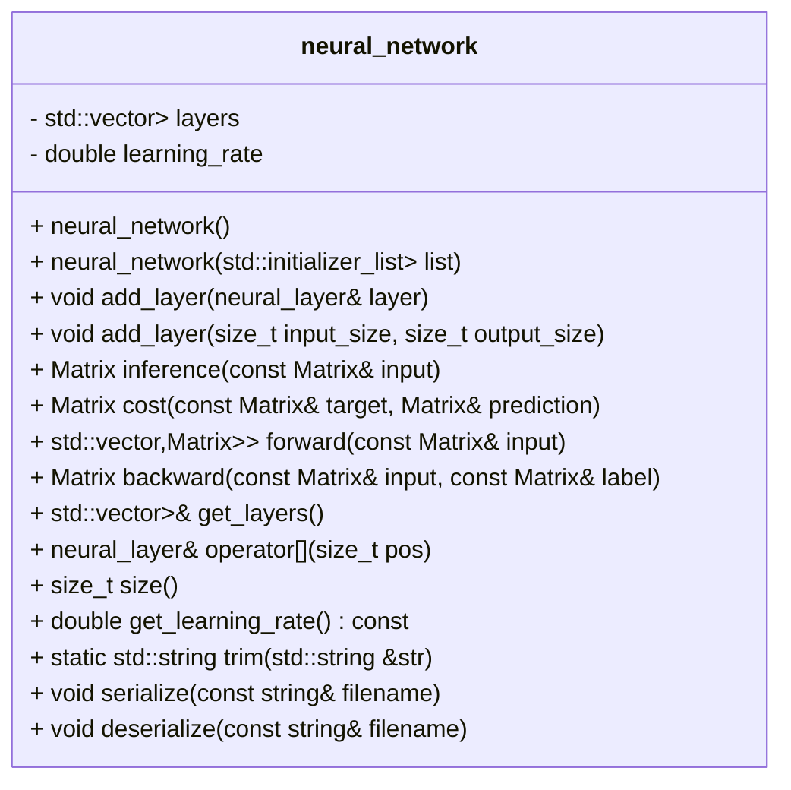

# Neural Network Class Documentation

The `neural_network` class represents a feedforward neural network. It consists of multiple layers (`neural_layer`) and provides functionalities for forward propagation, backward propagation, and serialization/deserialization.

## Class Structure

The `neural_network` class has the following structure:

```cpp
class neural_network {
private:
    std::vector<neural_layer<double>> layers;
    double learning_rate = 0.4;

public:
    neural_network() = default;

    neural_network(std::initializer_list<neural_layer<double>> list);

    void add_layer(neural_layer<double>& layer);
    void add_layer(size_t input_size, size_t output_size);

    Matrix<double> inference(const Matrix<double>& input);
    Matrix<double> cost(const Matrix<double>& target, Matrix<double>& prediction);

    std::vector<std::pair<Matrix<double>, Matrix<double>>> forward(const Matrix<double>& input);
    Matrix<double> backward(const Matrix<double>& input, const Matrix<double>& label);

    std::vector<neural_layer<double>>& get_layers();
    neural_layer<double>& operator[](size_t pos);
    size_t size();
    double get_learning_rate() const;

    static std::string trim(std::string& str);

    void serialize(const std::string& filename);
    void deserialize(const std::string& filename);
};
```



## Functionality

The `neural_network` class provides the following functionality:

- Constructors:
    - `neural_network()`: Default constructor.
    - `neural_network(std::initializer_list<neural_layer<double>> list)`: Constructor that takes an initializer list of `neural_layer` objects and initializes the network with those layers.

- Layer Management:
    - `void add_layer(neural_layer<double>& layer)`: Adds a `neural_layer` object to the network.
    - `void add_layer(size_t input_size, size_t output_size)`: Creates a new `neural_layer` object with the specified input and output sizes and adds it to the network.

- Forward Propagation:
    - `Matrix<double> inference(const Matrix<double>& input)`: Performs forward propagation on the network with the given input and returns the output prediction.
    - `Matrix<double> cost(const Matrix<double>& target, Matrix<double>& prediction)`: Calculates the cost between the target output and the predicted output.

- Backward Propagation:
    - `std::vector<std::pair<Matrix<double>, Matrix<double>>> forward(const Matrix<double>& input)`: Performs forward propagation on the network with the given input and returns a vector of pairs containing the weighted sum (`Z`) and activation (`A`) matrices for each layer.
    - `Matrix<double> backward(const Matrix<double>& input, const Matrix<double>& label)`: Performs backward propagation on the network with the given input and label. Updates the weights and biases of each layer and returns the loss.

- Layer Access:
    - `std::vector<neural_layer<double>>& get_layers()`: Returns a reference to the vector of `neural_layer` objects in the network.
    - `neural_layer<double>& operator[](size_t pos)`: Returns a reference to the `neural_layer` object at the specified position in the network.
    - `size_t size()`: Returns the number of layers in the network.

- Learning Rate:
    - `double get_learning_rate() const`: Returns the learning rate of the network.

- Serialization/Deserialization:
    - `static std::string trim(std::string& str)`: Trims leading and trailing spaces from a string.
    - `void serialize(const std::string& filename)`: Serializes the network to a file in a custom format.
    - `void deserialize(const std::string& filename)`: Deserializes the network from a file in the custom format.

## Implementation Details

- The `neural_network` class uses a vector of `neural_layer` objects to represent the layers of the network.
- The learning rate is set to a default value of 0.4 but can be modified.
- The `inference` function performs forward propagation on the network and returns the output prediction.
- The `cost` function calculates the cost between the target output and the predicted output.
- The `forward` function performs forward propagation on the network and returns a vector of pairs containing the weighted sum (`Z`) and activation (`A`) matrices for each layer.
- The `backward` function performs backward propagation on the network, updates the weights and biases of each layer, and returns the loss.
- The `get_layers` function returns a reference to the vector of `neural_layer` objects in the network.
- The `operator[]` function allows accessing a specific layer in the network.
- The `size` function returns the number of layers in the network.
- The `serialize` function serializes the network to a file in a custom format.
- The `deserialize` function deserializes the network from a file in the custom format.

## Conclusion

The `neural_network` class provides a high-level interface for creating, training, and using feedforward neural networks. It encapsulates the layers, forward and backward propagation, and serialization/deserialization functionality. Developers can use this class to easily create and manipulate neural networks for various machine learning tasks.